<!DOCTYPE html>
<html lang="ko">
<head>
    <meta charset="UTF-8">
    <link rel="stylesheet" href="styles.css">
</head>
<body>
    <header>
        <h1>지정 헌혈 프로젝트</h1>
    </header>
    <main>
        <section>
            <h2>지정헌혈이란?</h2>
            
헌혈자가 대상을 미리 지정해 놓고 하는 헌혈로써, 헌혈을 하는 사람이 헌혈을 하기 전에 수혈자를 지정하거나,  환자가 수혈을 받기 전에 헌혈자를 지정하는 경우를 모두 포함합니다.

        </section>
        <section>
            <h2>주제 선정 이유</h2>
            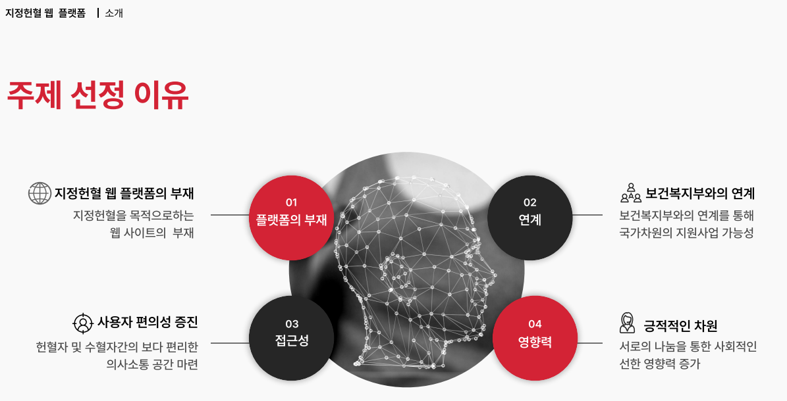</img>
        </section>
        <section>
            <h2>시나리오</h2>
            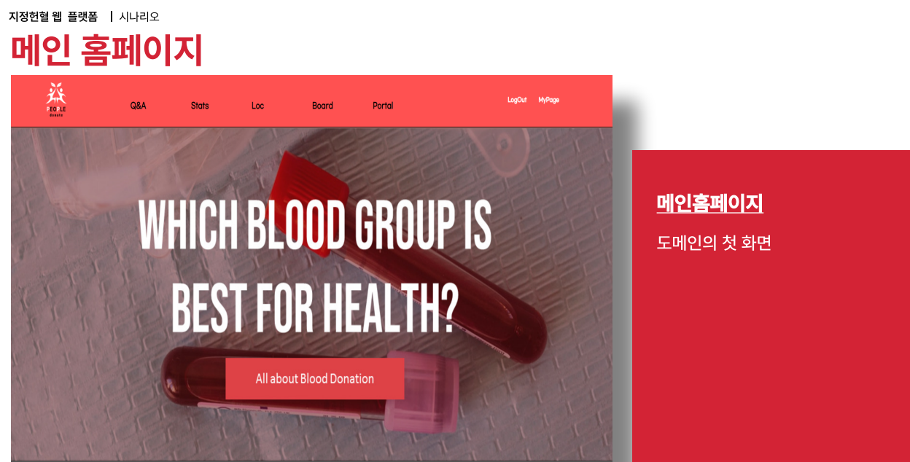</img>
            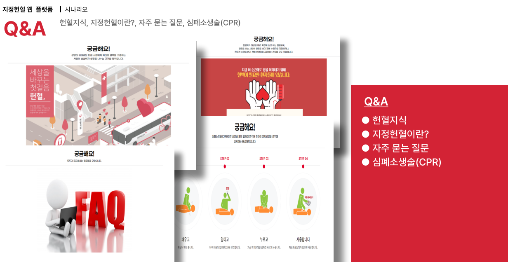</img>
            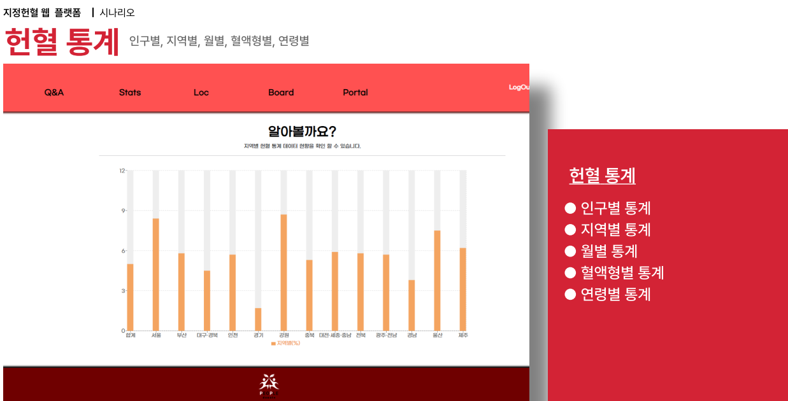</img>
            </img>
            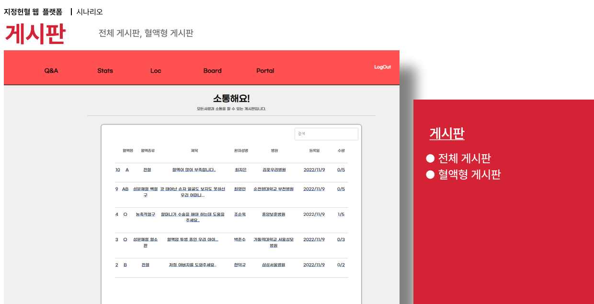</img>
            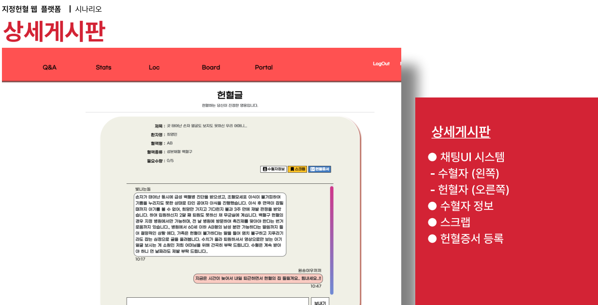</img>
            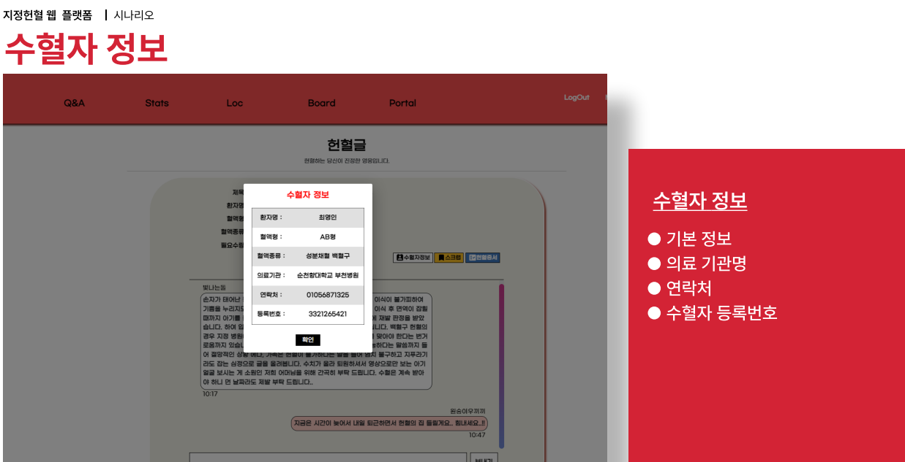</img>
            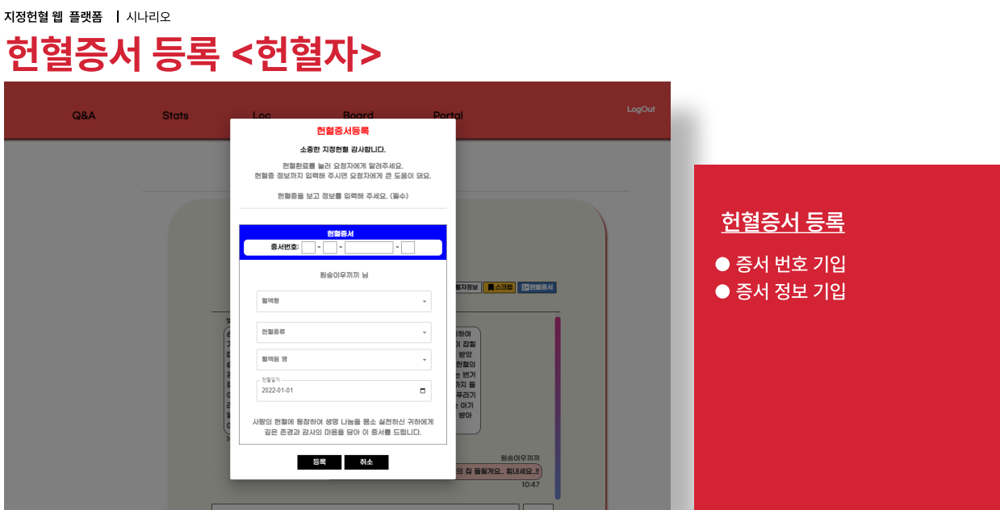</img>
            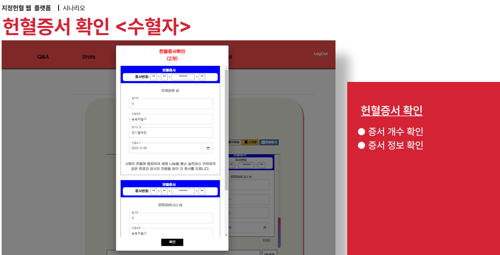</img>
            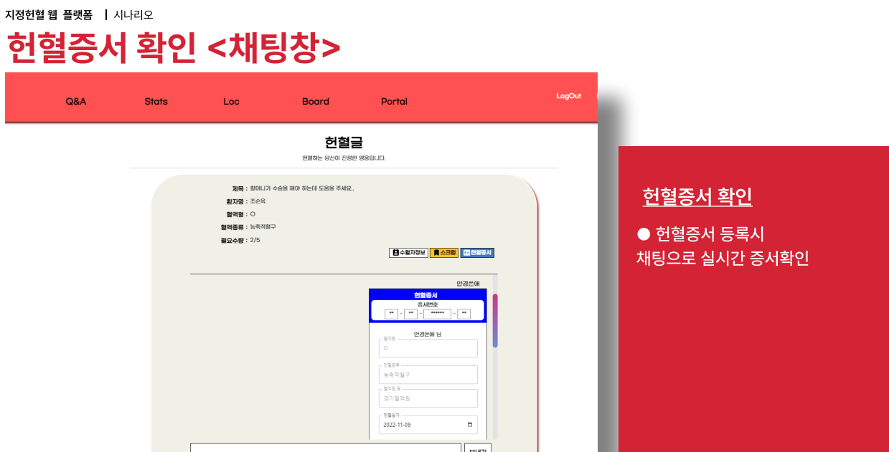</img>
            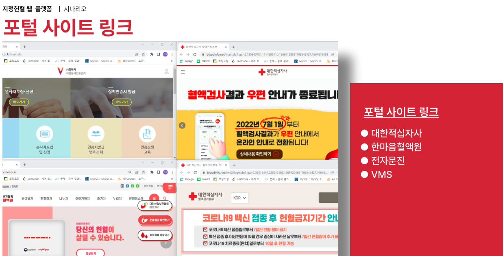</img>
            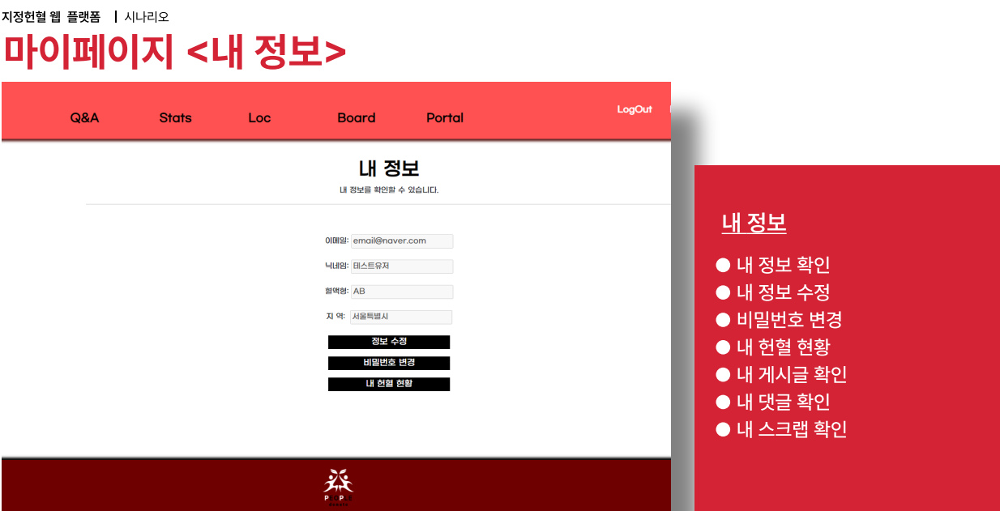</img>
            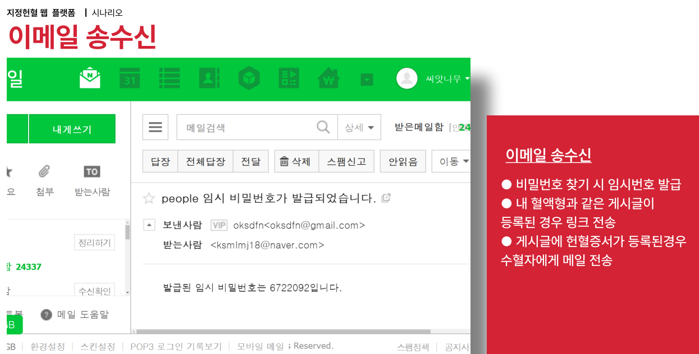</img>
            </img>
        </section>
        <section>
            <h2>기대 효과</h2>
            <ul>
                <li>긍정적인 영향력:   1. 서로 나눔을 통한 사회적인 <b>선한 영향력 증가</b> 2. 위급상황에 대한 <b>대처방안 마련</b> 3. 희귀 혈액형과 같은 특수한 상황에 대비한 <b>혈액유통 원활</b> </li>
            </ul>
        </section>
    </main>
    <footer>
        
지정 헌혈 프로젝트 © 2023

    </footer>
</body>
</html>
